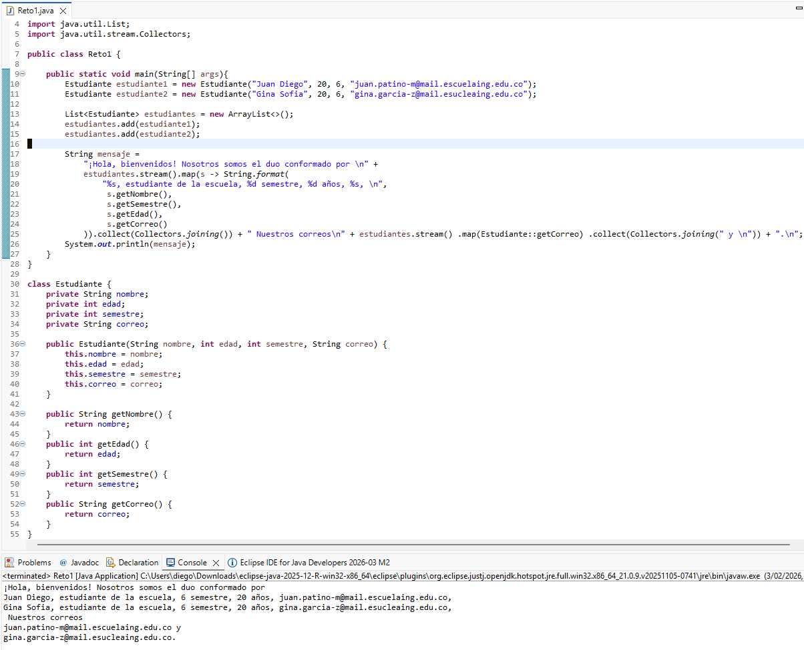
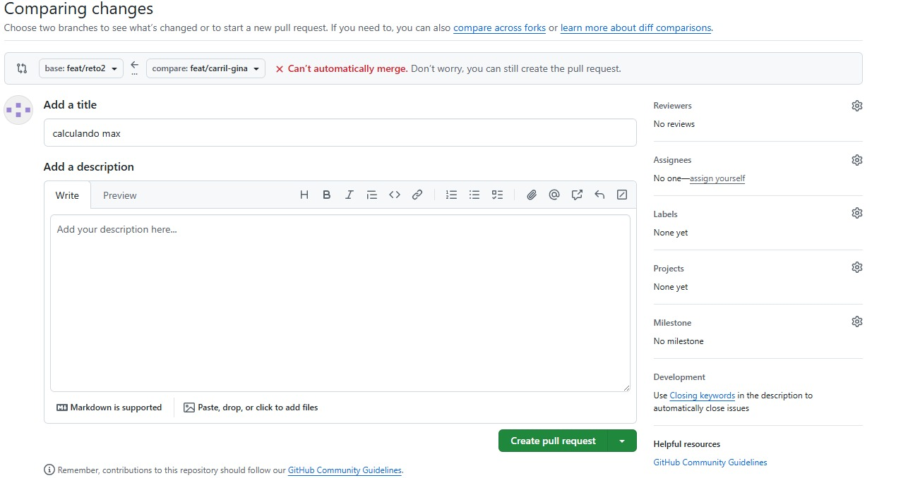
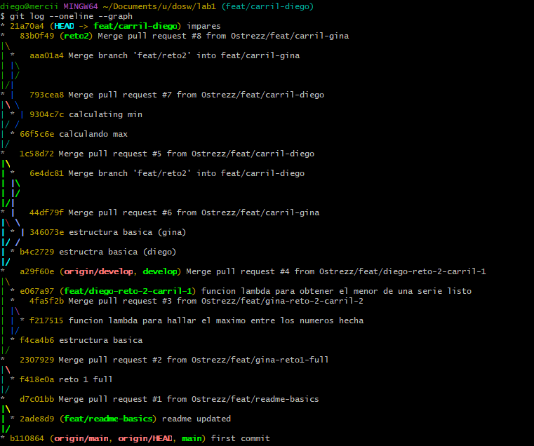

# Laboratorio 1 - dosw

## Integrantes
- Gina Sofia Garcia Zapata (sofiapeace)
- Juan Diego Patino Munoz (0strezz)

## Reto 1

Se crean nuestros "usuarios" (el de juan diego y mio), cada uno con la informacion correspondiente
y se guardan en una lista, de ahi usamos streams y un map para armar un string principal el cual
se imprimira en consola, tambien se hace uso de 'string formatting' el cual es una manera de concatenar
valores en un string.

## Reto 2

Los conflictos se generaban cuando ambos modificabamos el mismo archivo, por suerte GitHub ofrece una manera rapida de resolverlos,
al menos este tipo de conflictos...

**NOTA**: Este reto sera usado como checkpoint, por lo que haremos un merge en main para guardar cambios estables.

## Reto 3

## Reto 4

## Reto 5

## Reto 6

## Preguntas teoricas

TODO
=======
