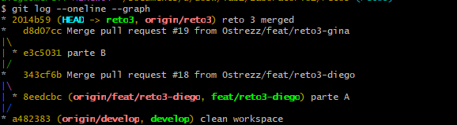
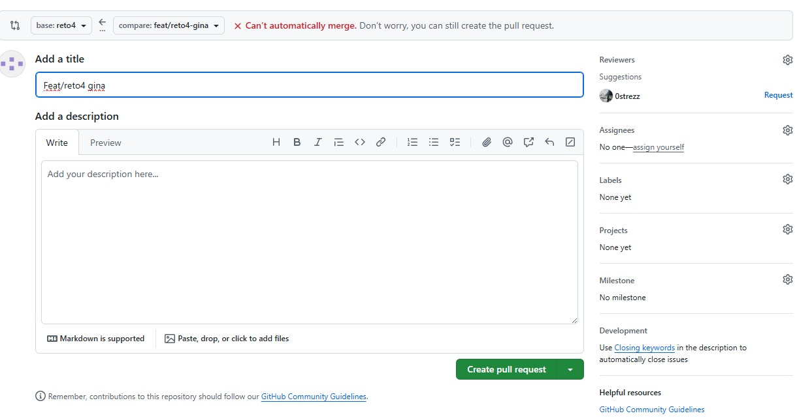
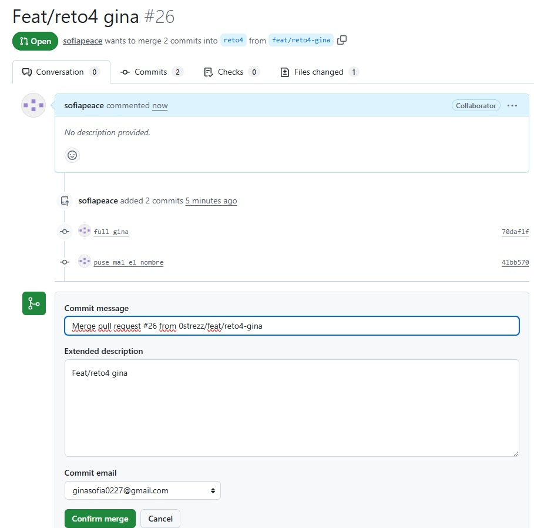
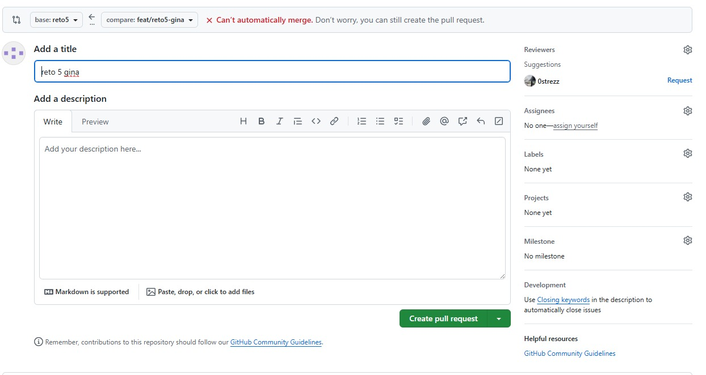
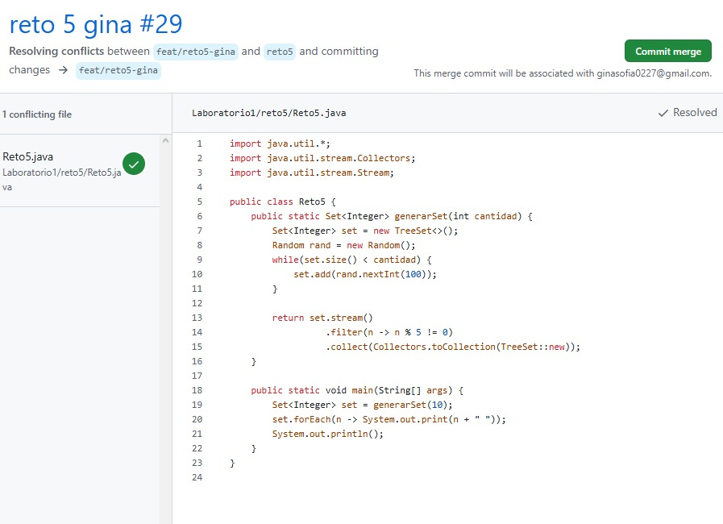

# Laboratorio 1 - dosw

## Integrantes
- Gina Sofia Garcia Zapata (sofiapeace)
- Juan Diego Patino Munoz (0strezz)

## Reto 1

Se crean nuestros "usuarios" (el de juan diego y mio), cada uno con la informacion correspondiente
y se guardan en una lista, de ahi usamos streams y un map para armar un string principal el cual
se imprimira en consola, tambien se hace uso de 'string formatting' el cual es una manera de concatenar
valores en un string.

## Reto 2

Los conflictos se generaban cuando ambos modificabamos el mismo archivo, por suerte GitHub ofrece una manera rapida de resolverlos,
al menos este tipo de conflictos...

**NOTA**: Este reto sera usado como checkpoint, por lo que haremos un merge en main para guardar cambios estables.

## Reto 3

En este caso github no sabe que merge hacer, por lo que hay que resolver el problema manualmente, la solucion aqui
fue combinar ambos metodos en uno solo.

## Reto 4

Aqui github nos daba un error dado que los metodos para combinar
se llamaban igual, lo que hicimos fue combinar la logica de ambos
en uno solo para que quedara solo un metodo funcional.

## Reto 5

Aqui github nos daba un error dado porque una persona estaba sobreescribiendo
el trabajo de la otra

## Reto 6

## Preguntas teoricas

1.
